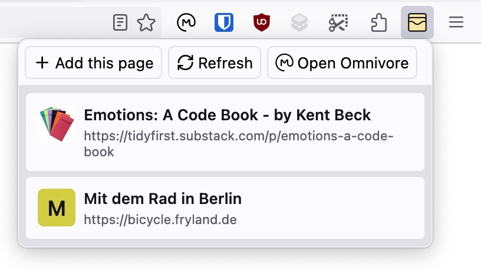

# Omnivore List Popup Web Extension (Firefox & Chrome)

Show a popup with a list of your [Omnivore](https://omnivore.app/) articles to quickly open or archive.

## Installation & Usage

1. Install the extension from the [Firefox Extensions page](https://addons.mozilla.org/firefox/addon/omnivore-list-popup/) or the [Chrome Web Store](https://chrome.google.com/webstore/detail/omnivore-list-popup/dnfckbihnohkfoaclfckbcebclmhleni).
2. Get an [Omnivore API Key](https://omnivore.app/settings/api) through your Omnivore Account.
3. Go into the extension’s settings and paste your Omnivore API key.
4. Launch the extension by clicking the new "Omnivore List Popup" button in your extension toolbar/dropdown.
5. Optional: Add the extension to your always-visible toolbar.

## Development Setup

1. Install the Node version defined in `.nvmrc` (e.g. with `nvm use`).
2. Install dependencies with `npm install`.
3. Run `npm run prepare-manifest -- -firefox` (or `-chrome`) to create the browser-specific `manifest.json`.
4. Run the build with `npm run build` to generate the output files.
5. Load the extension folder in [Firefox](about:debugging#/runtime/this-firefox) and/or Chromium.

### Development Commands

- Run `npm run dev` to watch files for changes and re-run the build.
- Run `npm run format` to format the code with [Prettier](https://prettier.io/).
- Run `npm run lint` to lint the code with [ESLint](https://eslint.org/).

## Releasing

1. Run `npm run create-releases` to generate the output files and extension archives in the root directory.
2. Upload the Firefox release on https://addons.mozilla.org/developers/addon/omnivore-list-popup/
3. Upload the Chrome release on https://chrome.google.com/webstore/devconsole
4. Remove the locally-created files after uploading via `npm run clean`.

## Contributing

If you have ideas or issues, please get in touch! You can either use [GitHub issues](https://github.com/herrherrmann/omnivore-list-popup/issues) or contact [herrherrmann](https://github.com/herrherrmann/) directly.

## Todos & Ideas

- [x] Add pagination to browse beyond 10 items ([issue #9](https://github.com/herrherrmann/omnivore-list-popup/issues/9))
- [x] Add keyboard shortcuts for opening the popup and adding the current page to Omnivore
- [x] Improve generation of fallback images (sometimes broken or very low-contrast characters)
- [ ] Optionally load other sets like archived items (via saved searches dropdown?)
- [ ] Cache API results for quicker load times
- [ ] Add possibility to delete items (additionally to archiving)
- [ ] Improve onboarding, e.g. make it possible to enter API key in popup
- [ ] Improve error handling
- [ ] Use Omnivore’s `savePage` API instead of `saveUrl` (to capture page content directly)
- [ ] Internationalization
- [ ] Cache list items locally for offline usage
- [ ] Highlight the popup button if the current page is added to Omnivore

## Acknowledgements

- Thanks to the amazing [In My Pocket](https://inmypocketaddon.com/) extension for inspiring this project. 👏
- Thanks to the [Omnivore team](https://omnivore.app/) for the nice Pocket alternative and open API.
- Thanks to the [Lucide project](https://lucide.dev/) for the icon set.
