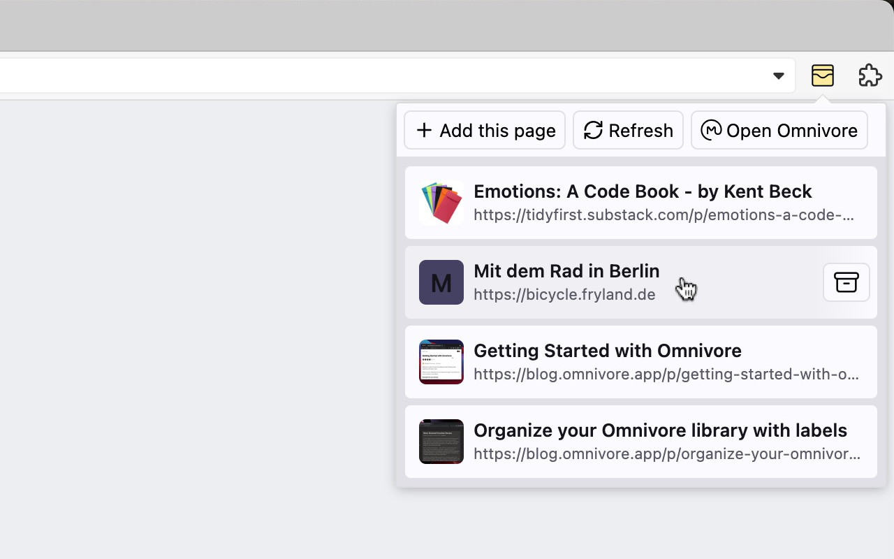

# Omnivore List Popup Firefox Extension

Show a popup with a list of your Omnivore articles to quickly open or archive.

## Installation & Usage

1. Get an [Omnivore API Key](https://omnivore.app/settings/api) through your Omnivore Account.
2. Install the extension from the [Firefox Extensions page](https://addons.mozilla.org/firefox/extensions/).
3. Go into the extension’s settings and paste your Omnivore API key.
4. Launch the extension by clicking the new "Omnivore List Popup" button in your Firefox extension toolbar/dropdown.
5. Optional: Add the extension to your always-visible toolbar.

## Development Setup

1. Install the Node version defined in `.nvmrc` (e.g. with `nvm use`).
2. Install dependencies with `npm install`.
3. Load the extension folder in [Firefox](about:debugging#/runtime/this-firefox).

## Todos

- [ ] Chrome compatibility
- [ ] Internationalization
- [ ] Split up code more (needs a bundler like Rollup)
